# Distributed Systems Security 
Distributed systems security is a critical aspect of designing and maintaining modern computing infrastructures. Distributed systems are collections of interconnected computers that work together to achieve a common goal, and they are prevalent in various applications, including cloud computing, web services, and large-scale enterprise systems. Ensuring the security of these distributed systems is essential to protect sensitive data, maintain system integrity, and prevent unauthorized access or attacks.

## Parte 1 
### Installing and Starting Keycloak
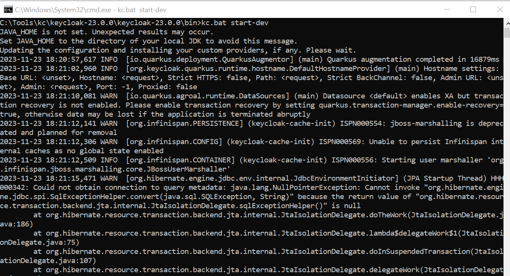

### Keycloak Administration
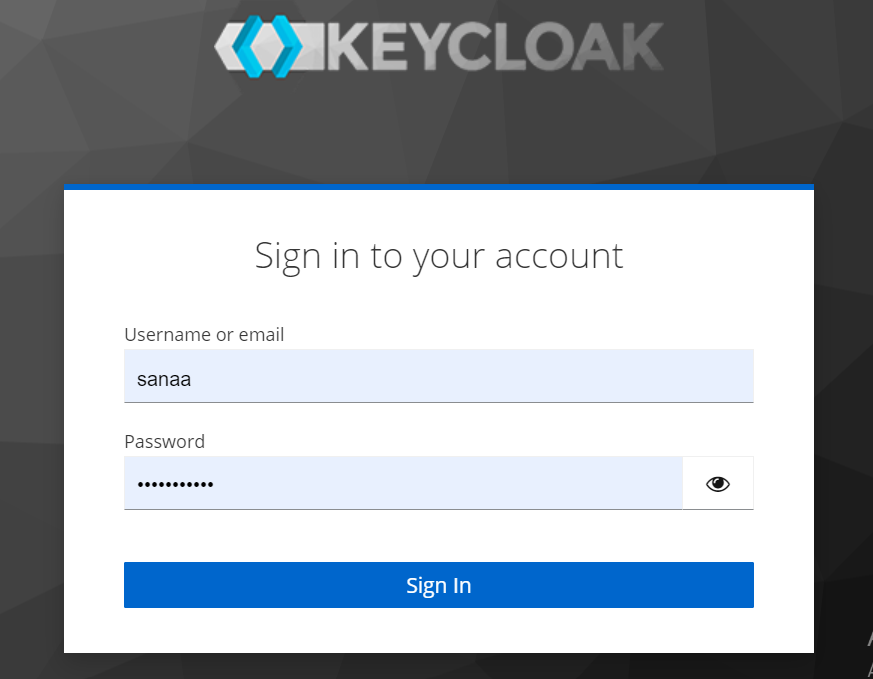
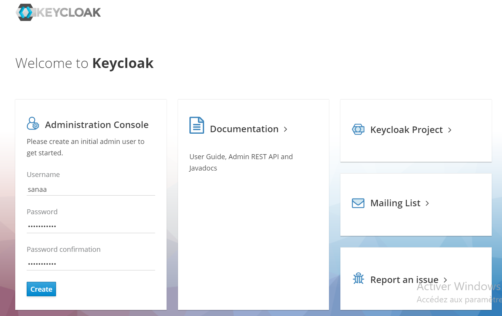

### Creating a realm and clients
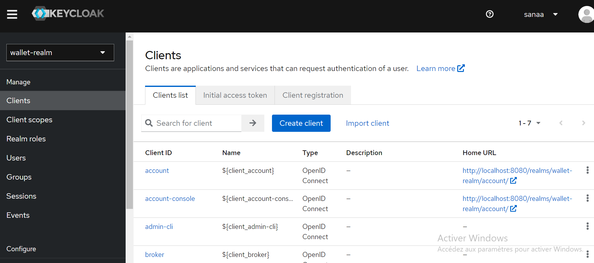
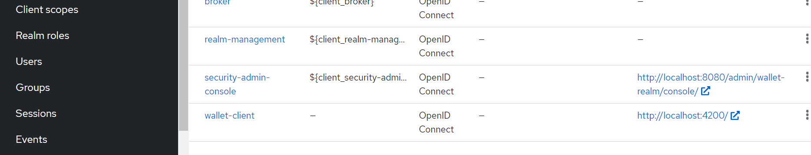

### Creating Users
#### User1 
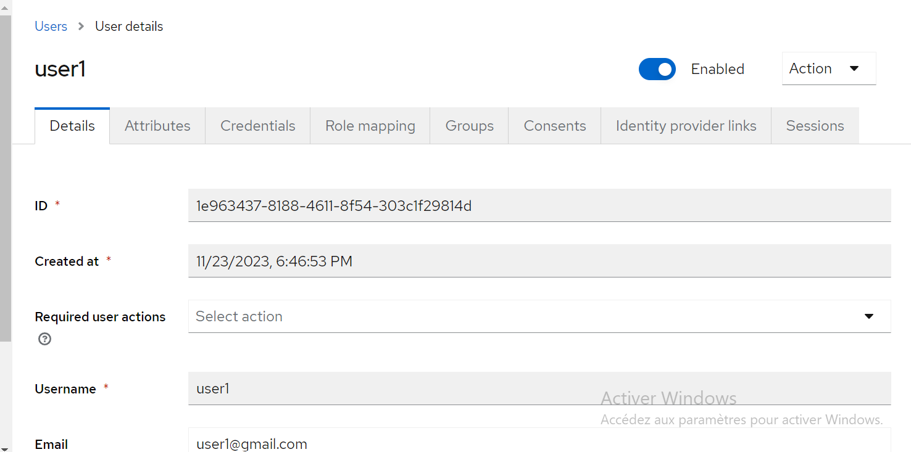
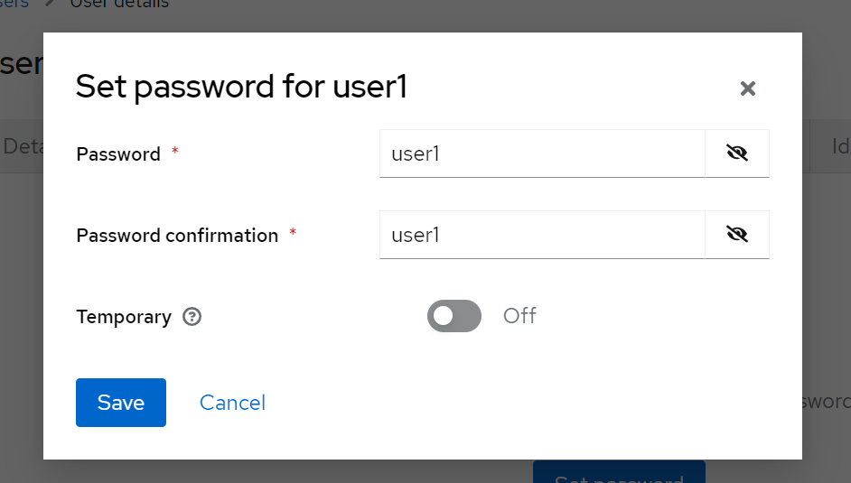

#### User2 
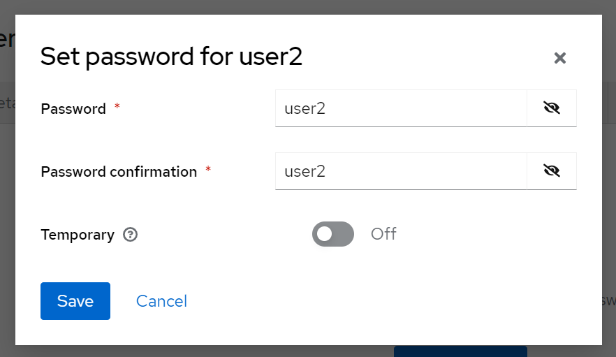

### Creating Roles
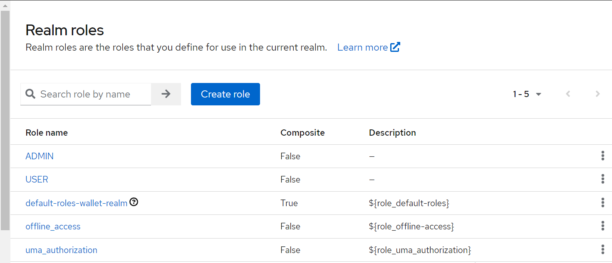

### Assign roles to users
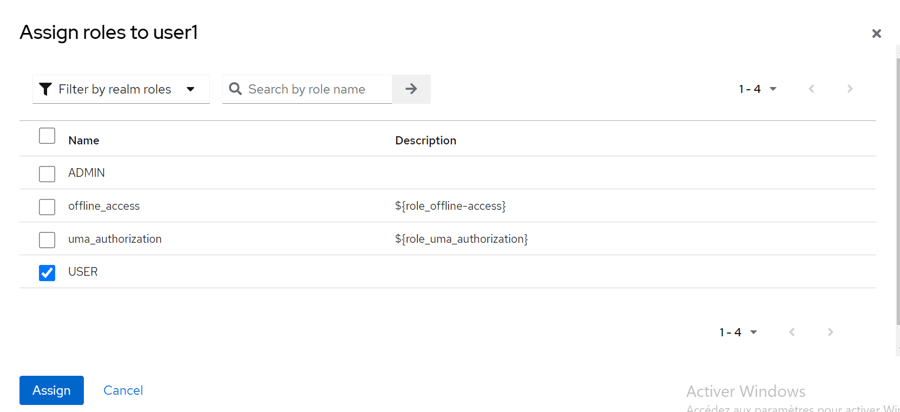
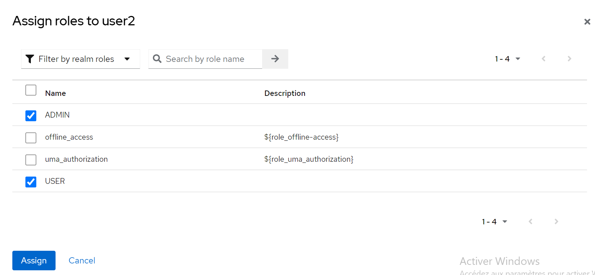

### Test in Postman
#### Test authentication with the password
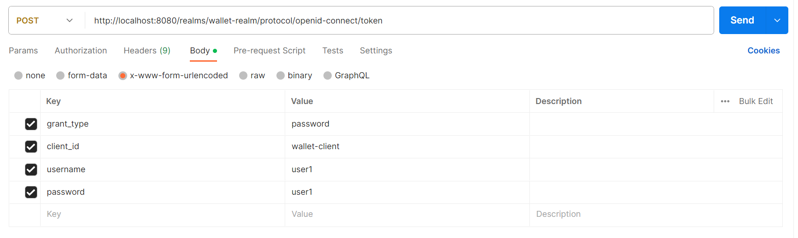
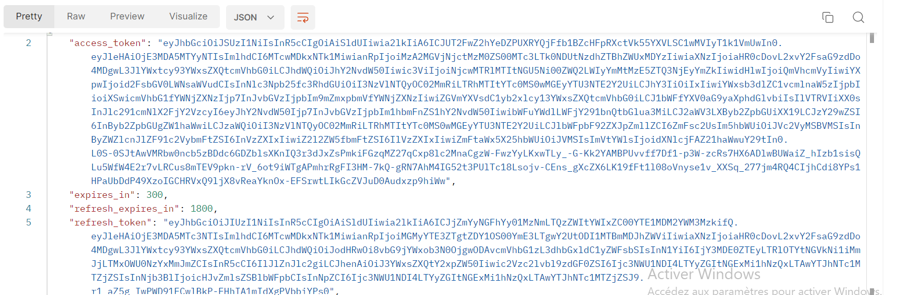

### Analyze the contents of both JWT Access Token and Refresh Token
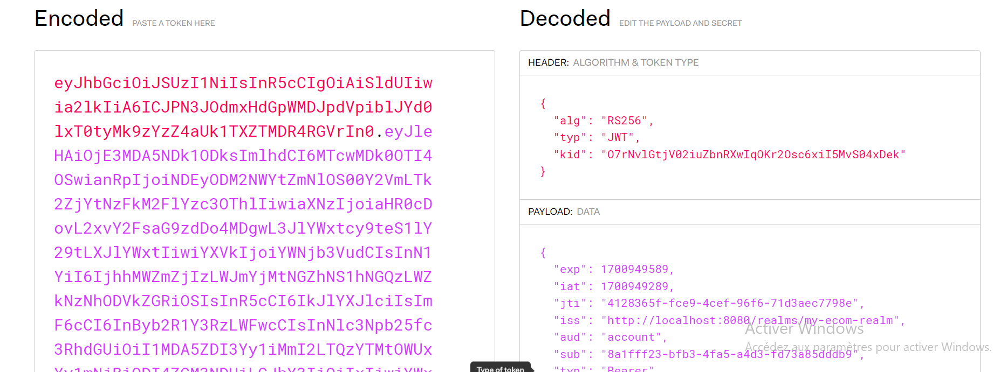
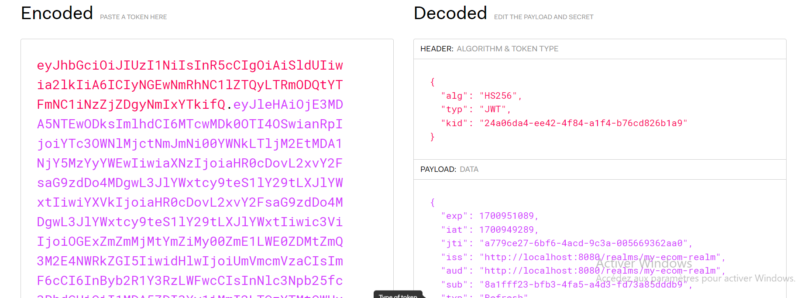

### Test authentication with the Refresh Token
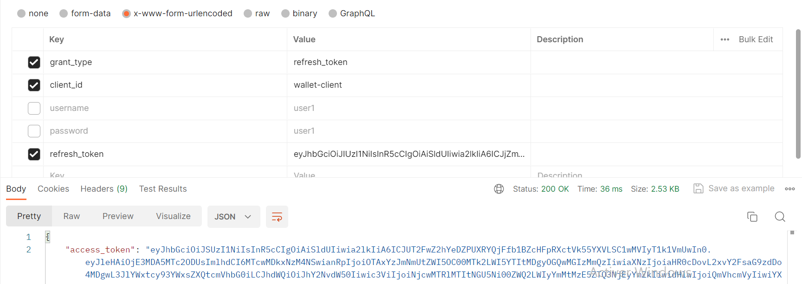

### Test authentication with Client ID and Client Secret
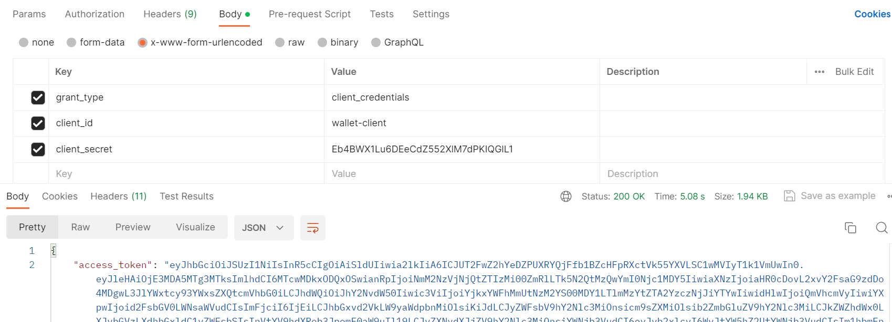

## Parte 2 : Secure applications with Keycloak
### Ebank Service 
#### application.properties
This configuration is for a Spring Boot application that incorporates an H2 in-memory database and utilizes Keycloak for authentication. The Spring Boot server is configured to run on port 8084, with an H2 in-memory database named "currency-deposit." The H2 console is enabled to facilitate interaction with the database through a web interface. On the Keycloak side, the configuration specifies the use of the "wallet-realm" realm, the "wallet-client" client, with a bearer-only requirement for authentication. The Keycloak authentication server URL is set to http://localhost:8080, and SSL is not required. These settings are crucial for the successful integration of the application with Keycloak and for managing data through the H2 in-memory database.

```
server.port=8084
spring.datasource.url=jdbc:h2:mem:currency-deposit
spring.h2.console.enabled=true

keycloak.realm=wallet-realm
keycloak.resource=wallet-client
keycloak.bearer-only=true
keycloak.auth-server-url=http://localhost:8080
keycloak.ssl-required=none

```
#### KeycloakAdapterConfig 
KeycloakAdapterConfig, is a configuration class for a Spring Boot application incorporating Keycloak for authentication. It is annotated with @Configuration, indicating its role in providing configuration details. Within the class, there is a method annotated with @Bean that creates and returns a bean of type KeycloakSpringBootConfigResolver. This bean is likely responsible for resolving and supplying Keycloak configuration details to the Spring Boot application.

```
@Configuration
public class KeycloakAdapterConfig {
    @Bean
    KeycloakSpringBootConfigResolver springBootConfigResolver(){
        return new KeycloakSpringBootConfigResolver();
    }
}
```

#### SecurityConfig 
The SecurityConfig class is a crucial part of a Spring Boot application's security configuration, specifically tailored for integration with Keycloak for authentication. Annotated with @KeycloakConfiguration and @EnableWebSecurity, this class extends KeycloakWebSecurityConfigurerAdapter, indicating its role in defining security settings for web applications using Keycloak.

```
@KeycloakConfiguration
@EnableWebSecurity
@ComponentScan(basePackageClasses = KeycloakSecurityComponents.class)
public class SecurityConfig extends KeycloakWebSecurityConfigurerAdapter {
    @Override
    protected SessionAuthenticationStrategy sessionAuthenticationStrategy() {
        return new RegisterSessionAuthenticationStrategy(new SessionRegistryImpl());
    }
    
    @Override
    protected void configure(AuthenticationManagerBuilder auth) throws Exception {
        auth.authenticationProvider(keycloakAuthenticationProvider());
    }
    
    @Override
    protected void configure(HttpSecurity http) throws Exception {
        super.configure(http);
        http.csrf().disable();
        http.authorizeRequests().antMatchers("/h2-console/**").permitAll();
        http.headers().frameOptions().disable();
        http.authorizeRequests().anyRequest().authenticated();
    }
}
```

### Wallet Service 
#### application.properties 

```
server.port=8082
spring.h2.console.enabled=true
spring.datasource.url=jdbc:h2:mem:currenciesDb
spring.graphql.graphiql.enabled=true


keycloak.realm=wallet-realm
keycloak.resource=wallet-client
keycloak.bearer-only=true
keycloak.auth-server-url=http://localhost:8080
keycloak.ssl-required=none
```

#### KeycloakAdapterConfig 

```
@Configuration
public class KeycloakAdapterConfig {
    @Bean
    KeycloakSpringBootConfigResolver springBootConfigResolver(){
        return new KeycloakSpringBootConfigResolver();
    }
}
```

#### SecurityConfig

```
@KeycloakConfiguration
@EnableWebSecurity
@ComponentScan(basePackageClasses = KeycloakSecurityComponents.class)
public class SecurityConfig extends KeycloakWebSecurityConfigurerAdapter {
    @Override
    protected SessionAuthenticationStrategy sessionAuthenticationStrategy() {
        return new RegisterSessionAuthenticationStrategy(new SessionRegistryImpl());
    }
    
    @Override
    protected void configure(AuthenticationManagerBuilder auth) throws Exception {
        auth.authenticationProvider(keycloakAuthenticationProvider());
    }

    @Override
    protected void configure(HttpSecurity http) throws Exception {
        super.configure(http);
        http.csrf().disable();
        http.authorizeRequests().antMatchers("/h2-console/**").permitAll();
        http.authorizeRequests().antMatchers("/graphql/**").permitAll();
        http.authorizeRequests().antMatchers("/graphiql/**").permitAll();
        http.headers().frameOptions().disable();
        http.authorizeRequests().anyRequest().authenticated();
    }
}
```

### Wallet front angular 
#### navbar.component.html
This HTML code represents a responsive navigation bar with links to different sections of the web application. It also includes conditional rendering for user authentication, displaying either the user's name or a login button, along with a dropdown menu for user-related actions. The styling is achieved through Bootstrap classes for a clean and responsive design

```
<nav class="navbar navbar-expand-lg navbar-dark bg-primary">
  <div class="container-fluid">
    <a class="navbar-brand" href="#">Navbar</a>
    <button class="navbar-toggler" type="button" data-bs-toggle="collapse" data-bs-target="#navbarSupportedContent" aria-controls="navbarSupportedContent" aria-expanded="false" aria-label="Toggle navigation">
      <span class="navbar-toggler-icon"></span>
    </button>
    <div class="collapse navbar-collapse" id="navbarSupportedContent">
      <ul class="navbar-nav me-auto mb-2 mb-lg-0">
        <li class="nav-item">
          <a class="nav-link active" aria-current="page" routerLink="/wallets">My Wallets</a>
        </li>
        <li class="nav-item">
          <a class="nav-link active" aria-current="page" routerLink="/continents">Countries</a>
        </li>
        <li class="nav-item">
          <a class="nav-link" routerLink="/currencies">Currencies</a>
        </li>
        <li class="nav-item">
          <a class="nav-link" routerLink="/currencyDeposit">Bank Deposit</a>
        </li>

      </ul>
      <ul class="navbar-nav float-end">
        <li class="nav-item">
           <a class="nav-link" *ngIf="securityService.profile; else loginTemplate">
             <a>{{securityService.profile.firstName}}</a>
            </a>
          <ng-template #loginTemplate>
            <a class="btn nav-link" aria-current="page" (click)="login()">Login</a>
          </ng-template>
        </li>
        <li class="nav-item dropdown" *ngIf="securityService.profile">
          <a class="nav-link dropdown-toggle" href="#" role="button" data-bs-toggle="dropdown" aria-expanded="false">
          </a>
          <ul class="dropdown-menu" aria-labelledby="navbarDropdown" >
            <li><a class="dropdown-item" (click)="onLogout()" >Logout</a></li>
            <li><a class="dropdown-item" href="#">Profile</a></li>
          </ul>
        </li>
      </ul>
    </div>
  </div>
</nav>

```

#### navbar.component.ts
This Angular component (NavbarComponent) is designed to handle the navigation bar functionality, including user authentication and logout processes through interactions with the SecurityService and Keycloak. The login method initiates the Keycloak login, and the onLogout method initiates the Keycloak logout.

```
export class NavbarComponent implements OnInit {

  constructor(public securityService:SecurityService) { }

  public async ngOnInit() {

  }

  onLogout() {
    this.securityService.kcService.logout(window.location.origin)

  }
  public async getToken() {
  }

  async login(){
    await this.securityService.kcService.login({
      redirectUri : window.location.origin
    })

  }
}
```

#### Class AuthGuard
This AuthGuard class extends the functionality of KeycloakAuthGuard and is designed to be used as a guard in Angular routes. It ensures that users are authenticated and have the necessary roles to access protected routes. If not, it redirects them to the Keycloak login page.

```
export class AuthGuard extends KeycloakAuthGuard {
  constructor(
    protected override readonly router: Router,
    protected readonly keycloak: KeycloakService
  ) {
    super(router, keycloak);
  }

  public async isAccessAllowed(
    route: ActivatedRouteSnapshot,
    state: RouterStateSnapshot
  ) {
    // Force the user to log in if currently unauthenticated.
    if (!this.authenticated) {
      await this.keycloak.login({
        redirectUri: window.location.origin
      });
    }

    // Get the roles required from the route.
    const requiredRoles = route.data['roles'];

    // Allow the user to proceed if no additional roles are required to access the route.
    if (!Array.isArray(requiredRoles) || requiredRoles.length === 0) {
      return true;
    }

    // Allow the user to proceed if all the required roles are present.
    return requiredRoles.every((role) => this.roles.includes(role));
  }
}
```

#### Class SecurityService
The SecurityService class encapsulates functionality related to Keycloak authentication and user roles in an Angular application. It initializes and updates the user's profile based on Keycloak events and provides a method to check if the user has specific roles.

```
@Injectable({providedIn : "root"})
export class SecurityService {
  public profile? : KeycloakProfile;
  constructor (public kcService: KeycloakService) {
    this.init();
  }
  init(){
    this.kcService.keycloakEvents$.subscribe({
      next: (e) => {
        if (e.type == KeycloakEventType.OnAuthSuccess) {
          this.kcService.loadUserProfile().then(profile=>{
            this.profile=profile;
          });
        }
      }
    });
  }
  public hasRoleIn(roles:string[]):boolean{
    let userRoles = this.kcService.getUserRoles();
    for(let role of roles){
      if (userRoles.includes(role)) return true;
    } return false;
  }
}

```

#### app-routing.module.ts
This code sets up the routing configuration for an Angular application. It defines routes for components such as CurrenciesComponent, ContinentsComponent, WalletsComponent, WalletTransactionsComponent, and CurrencyDepositComponent. Two of these routes are protected by the AuthGuard, ensuring that only authenticated users with the specified roles can access them. The routes are then exported in the AppRoutingModule for use in the application.

```
const routes: Routes = [
  {
    path : "currencies", component : CurrenciesComponent
  },
  {
    path : "continents", component : ContinentsComponent
  },
  {
    path : "wallets", component : WalletsComponent,
    canActivate :[AuthGuard], data : { roles : ['USER']}

  },
  {
    path : "transactions/:walletId", component : WalletTransactionsComponent,
    canActivate :[AuthGuard], data : { roles : ['USER']}

  },
  {
    path : "currencyDeposit", component : CurrencyDepositComponent,
  }
];

@NgModule({
  imports: [RouterModule.forRoot(routes)],
  exports: [RouterModule]
})
export class AppRoutingModule { }
```

### Execution 
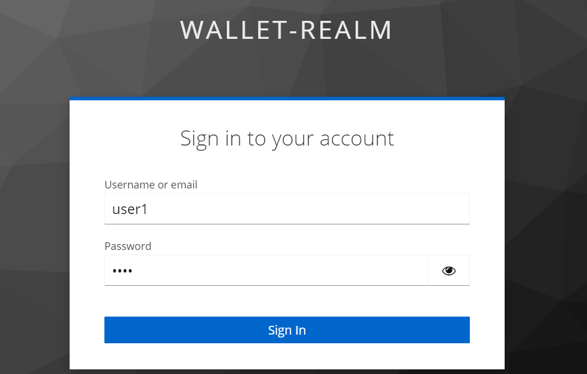
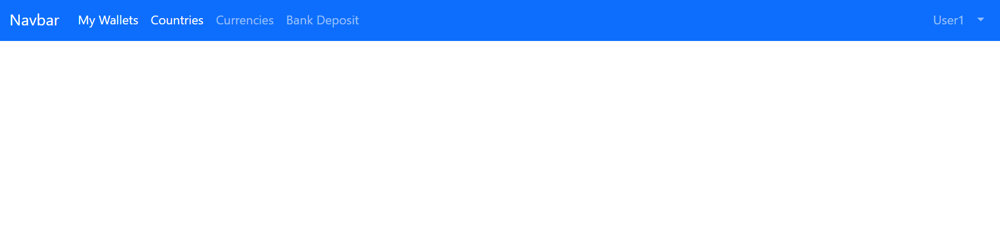
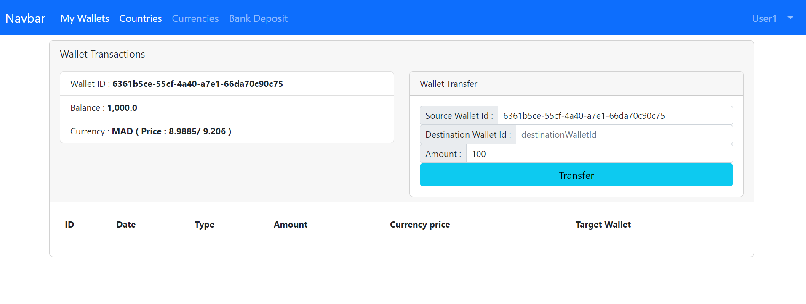
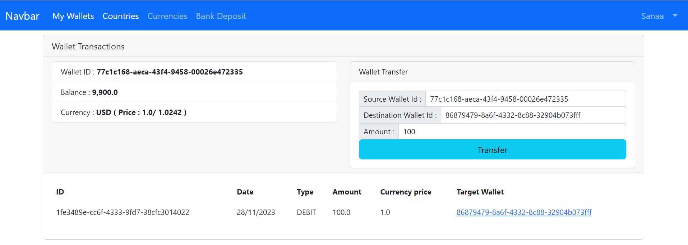

